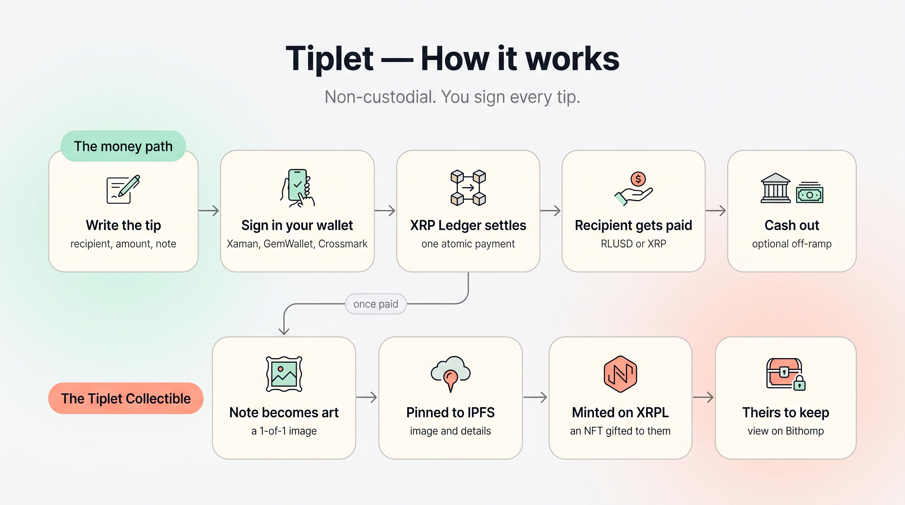
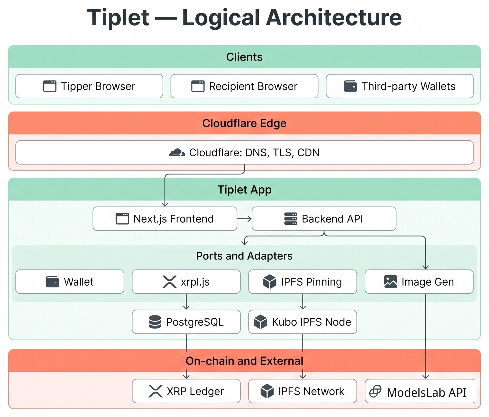

**Send a tip that lasts forever.**

Drop a tip with a note. They get real money, plus a one-of-a-kind collectible made from your note.

Tiplet is a dead-simple way to tip someone in the real world. You send a small tip, it lands
in the recipient's own wallet as spendable money, and your thank-you note becomes a one-of-a-kind
art collectible that is minted to their wallet as an NFT.

Built on the XRP Ledger. No app for the recipient to install. No lock-in. You never hand your
money to us.

> **This repo is the concept and the tester guide, not the code.** It explains what Tiplet is
> and walks new testers through trying it on the XRP Ledger **Testnet**. If you were invited to
> test, start with the **[Tester Guide](TESTING.md)**.

  

## The idea

Tipping today is clunky. Cash is gone, apps are walled gardens, and a "thank you" vanishes the
moment it is sent. Tiplet fixes both halves of that.

- **The money is real and theirs.** A tip settles straight into a wallet the recipient controls,
  in **RLUSD** (a dollar-pegged stablecoin) or **XRP**. They can move it to a bank through a
  regular off-ramp whenever they like. We never take custody.
- **The thank-you becomes a keepsake.** Every tip mints a **Tiplet Collectible**: a whimsical,
  one-of-a-kind NFT whose art is generated from the note you wrote, gifted to the person you
  tipped. A thank-you they can actually keep.

## How it works

A tip runs two paths at once, shown in the diagram above.

**The money path (non-custodial).**

1. Open the Tiplet web app. Enter the recipient's address, an amount in XRP or RLUSD, and a
   short thank-you note.
2. Connect your wallet (Xaman, GemWallet, or Crossmark) and **sign the tip yourself**. Tiplet
   builds the transaction; your wallet approves it. We never hold your money.
3. The XRP Ledger settles it in one atomic payment, straight to the recipient.
4. The recipient has the funds in their own wallet, ready to cash out through a third-party
   service (MoonPay, Transak, Kraken, and the like) whenever they want.

**The Tiplet Collectible path.**

Once the payment is confirmed, your note seeds a one-of-a-kind image, the image and its details
are pinned to **IPFS**, and a **Tiplet Collectible** NFT is minted on the XRP Ledger and gifted
to the recipient. You see a preview on the success screen, and the collectible is viewable in any
XRPL wallet or marketplace such as **Bithomp**.

## Why Tiplet is different

Plenty of tools can move a stablecoin tip on the XRP Ledger. That part is plumbing. What no one
else does is turn the tip into a collectible. The Tiplet Collectible is the difference: real
money for the person you are thanking, plus a one-of-a-kind keepsake made from your note, theirs
to keep, resell, or trade.

## Under the hood

Tiplet is one small web app in front of the XRP Ledger, with a clean split between the pieces so
any vendor is a swap, not a rewrite.

  

- **Frontend + backend.** A Next.js app. The frontend is the tip form, wallet connect, and the
  success screen. The backend builds the unsigned transaction, checks the tip against its rules,
  watches the ledger to confirm settlement, and drives the collectible mint. It never holds a key
  that can move your money.
- **Wallet.** You sign with your own wallet (Xaman, GemWallet, or Crossmark). Tiplet only prepares
  the transaction for you to approve.
- **XRP Ledger.** Settlement and the NFT mint both happen on-chain, via `xrpl.js`.
- **Art + storage.** The note seeds a 1-of-1 image from an image model (ModelsLab); the image and
  its metadata are pinned to **IPFS** (a Kubo node) so any wallet can fetch the art.
- **Database.** PostgreSQL keeps tip history and the collectible records. It never holds keys or
  the private note beyond what the recipient can see.

**The one principle everything is built around: you sign every tip.** Tiplet is non-custodial by
construction. The platform only builds transactions and watches confirmed results; it never moves
your funds.

## For testers

Want to try it? The **[Tester Guide](TESTING.md)** walks you through it end to end on the XRP
Ledger Testnet: create a Xaman wallet, switch it to Testnet, grab free test XRP and RLUSD, find
your address, open the app, and send your first tip. It also covers how to get added so you can
open Tiplet inside Xaman.

## What we will never claim

Because Tiplet moves real money, the honest limits are part of the product, not a footnote.

- We never take custody of your funds. You sign every tip from your own wallet.
- We do not promise instant or fee-free cash-out. Moving money to a bank happens through a third
  party, on their terms, with their fees and their checks.
- The collectible art is generated and whimsical. It is a fun keepsake, not hand-drawn fine art.

## Status

Early and in active development, built for the **Make Waves on XRPL** challenge. Tiplet runs today
on the **XRP Ledger Testnet** at **[testnet.tiplet.io](https://testnet.tiplet.io)**, where tips
settle and collectibles mint on the real test ledger (no real money). Mainnet comes later, at
**tiplet.io**. Expect rough edges and rapid change while the core flow comes together.

**Where this is going: send a little, or rally a lot.** The same rails that carry a tip can carry
a fundraiser. We are extending Tiplet so a group of small contributions can back a person or a
cause, with tiny fees and a collectible for every backer.

---

Built by [@realgrapedrop](https://github.com/realgrapedrop). Questions or want to test? DM
**[@realgrapedrop](https://x.com/realgrapedrop)** on X.
